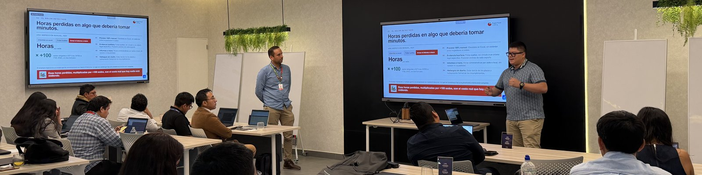

  

 

## 👨‍💻 Sobre mí

Soy **profesional de datos** con **+3 años de experiencia** en proyectos de **Analítica Avanzada**.

Actualmente trabajo como **Data Analyst en Supermercados Peruanos**, enfocado en:

- 🤖 **Automatización** de procesos y flujos de datos
- 🏗️ **Desarrollo de plataformas y productos BI**
- 🧱 **Arquitectura de soluciones tecnológicas escalables**

Me apasiona investigar cómo resolver problemas del mundo real aplicando **Inteligencia Artificial**.

 

## 🛠️ Stack

 

## 🚀 Proyectos destacados

<table>
<tr>
<td width="50%" valign="top">

### 🧾 [Kipumia](https://github.com/cesardataviz/kipumia)
Plataforma web de finanzas personales con Next.js 16 y Supabase — resumen tipo "quipu" de categorías, movimientos y autenticación completa.

  

</td>
<td width="50%" valign="top">

### 🚗 [Car Damage Triage](https://github.com/cesardataviz/model-cnn-siniestros)
Clasificador de daños vehiculares con CNN + Grad-CAM, inferencia vía Databricks y webapp de triage de siniestros.

  

</td>
</tr>
<tr>
<td width="50%" valign="top">

### 🦺 [SST Inspecciones](https://github.com/cesardataviz/sst-inspecciones)
Plataforma de inspecciones de seguridad con IA (Gemini) para clasificar evidencia, generar informes SST/PRE-ITSE y gestionar hallazgos.

  

</td>
<td width="50%" valign="top">

### 🔗 [Linktree](https://github.com/cesardataviz/Linktree)
Clon de Linktree construido con Next.js y Supabase, con autenticación por magic link.

 

</td>
</tr>
</table>

 

## 📊 Estadísticas

 

## 🌐 Conecta conmigo

